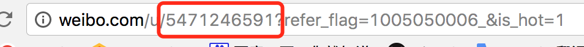

# WeiboBlackList
微博批量拉黑

## 安装
### 1. 下载

### 2. 安装 Python
[Python 3.6.3](https://www.python.org/downloads/release/python-363/)
选择对应版本安装

### 3. 安装 Fiddler
[官网](http://www.telerik.com/fiddler)

也可以 360软件管家 直接搜索安装

## 运行
1. 登录网页版微博，找到一个用户，准备拉黑。
2. 打开 Fiddler 
3. 拉黑刚刚准备的测试用户
4. 如下图所示，在 Fiddler 中选中对应请求，选择 Raw 格式进行查看，并将结果复制到 http.txt 中
6. 在当前文件夹打开命令行，执行 `python run.py` ， 就能拉黑 list.txt 中的所有用户。

## 说明
list.txt 中是 微博监督员 关注列表前 100 个用户的 UID。 现在微博只能查看前 5 页关注列表，所以不能获取全部 400 多个微博监督员的 UID。 

欢迎大家补充 微博监督员 的 UID 到 list.txt。网页版微博打开主页，第一串数字就是 UID。 

## 问题
其实我对 Python 不是很熟悉，感觉 `request.urlopen` 慢的不可思议。
